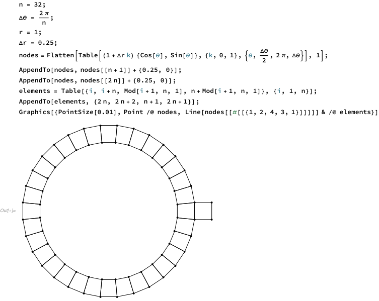
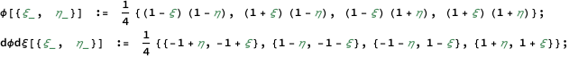
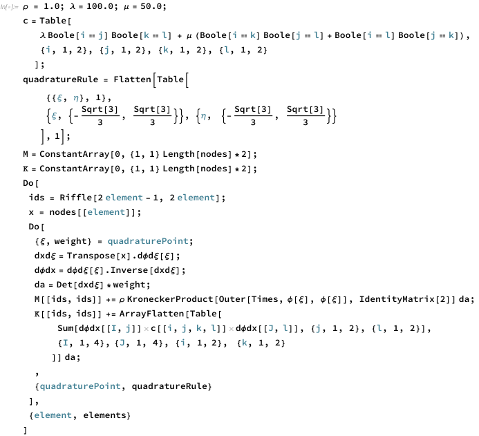

There is a great video on numberphile's youtube channel, where Tadashi Tokieda observes an interesting phenomenon: if you tap the rim of a coffee mug with a spoon, you get slightly different pitches, depending on where you tap. He gives a beautiful explanation on why this occurs, and how to understand it intuitively. If you haven't seen this video already, please go watch it!

<iframe width="560" height="315" src="https://www.youtube.com/embed/MfzNJE4CK_s" title="YouTube video player" margin="auto" display="block" frameborder="0" allow="accelerometer; autoplay; clipboard-write; encrypted-media; gyroscope; picture-in-picture" allowfullscreen></iframe>

This problem seems simple, but it actually touches on a lot of math and physics topics that are close to my heart (theory of elasticity, partial differential equations, eigenvalue problems). It makes for a nice example of how the finite element method can be used simulate and analyze physical systems. In these notes, we'll write a small 2D finite element code from scratch in Mathematica to perform the analysis.

## Finite Element Analysis

### Meshing: Discretize the Domain

The starting point for any finite element analysis is a mesh that represents the geometry we care about. For this analysis, we'll approximate the mug geometry in 2D with a coarse mesh made up of a ring of quadrilateral elements, with an extra square hanging off one side to represent the handle:

The next step is to define "shape functions" for the elements that appear in the mesh, so that we can parametrize the solution over the entire domain, by just specifying values at the nodes. For 4-node quadrilateral elements, the shape functions are:

$$
\phi(\xi, \eta) \coloneqq \frac{1}{4}\begin{bmatrix}
(1 - \xi) (1 - \eta) \\
(1 + \xi) (1 - \eta) \\
(1 - \xi) (1 + \eta) \\
(1 + \xi) (1 + \eta)
\end{bmatrix}
$$

or, in Mathematica (the derivatives w.r.t. $\xi, \eta$  will be useful in just a moment)

### Physics: Mechanics of Vibrations

Now that the domain has been discretized, we can look at the physics. The classical-mechanics way to describe systems like this is to start off by writing down expressions for the kinetic energy

$$
T \;\;=\;\; \frac{1}{2} \int_\Omega \rho(\bold{x}) \; \dot{u}_i(\bold{x}) \; \dot{u}_i(\bold{x}) \; \text{d}\bold{x}
\;\;= \;\;\frac{1}{2} \bold{\dot{u}}^\top \bold{M} \; \bold{\dot{u}}
$$

and potential energy [^1] 

$$
V \;\;=\;\; 
\frac{1}{2} \int_\Omega \frac{\partial u_i}{\partial x_j}\bigg|_{\bold{x}} \;\; C_{ijkl} \;\; \frac{\partial u_k}{\partial x_l}\bigg|_{\bold{x}} \; \text{d}\bold{x} \;\;= \;\;\frac{1}{2} \bold{u}^\top \bold{K} \; \bold{u},
$$

where $\bold{u}$ is our vector of nodal displacements. From here, the behavior of the system is described by the Euler-Lagrange equations, where $L = T - V$ is the "Lagrangian", 

$$
\begin{align}
\bold{0} &= \frac{d}{dt} \bigg(\frac{\partial L}{\partial \dot{\bold{u}}}\bigg) - \frac{\partial L}{\partial \bold{u}} \\ \\
&= \frac{d}{dt} \bigg(\frac{\partial T}{\partial \dot{\bold{u}}}\bigg) + \frac{\partial V}{\partial \bold{u}} \\ \\
&= \frac{d}{dt} (\bold{M} \; \bold{\dot{u}}) + \bold{K} \; \bold{u} \\ \\
\Aboxed{
\bold{0} &= \bold{M} \; \bold{\ddot{u}} + \bold{K} \; \bold{u}
}
\end{align}
$$

So, after turning the algebraic crank, we get a vector-valued version of the equation for a simple harmonic oscillator, which makes perfect sense. Now, the "mass" and "stiffness" terms in the equation are actually matrices rather than scalars, but much of the intuition from the 1D problem (sinusoidal solutions, natural frequencies, etc.) still applies. 

Here's some Mathematica code to calculate these mass and stiffness matrices, $\bold{M}, \bold{K}$:

For brevity, I've omitted some steps on how to derive the code that is used to calculate $\bold{M}, \bold{K}$, but a more detailed explanation will be given in a future set of notes.

[^1]: the tensor $C_{ijkl}$​ is analogous to the spring constant in the expression for the potential energy of a spring $U_\text{spring} \coloneqq \frac{1}{2} \Delta L \; k \; \Delta L$​.

### Mode Shapes and their Natural Frequencies

Now that we have $\bold{M}, \bold{K}$ and we know that the coffee mug satisfies the equation $\bold{M} \; \bold{\ddot{u}} + \bold{K} \; \bold{u} = \bold{0}$, we can start simulating the response of the mug. In the video, Dr. Tokieda refers to the mode shapes of the mug, which are solutions of the form:

$$
\bold{u}(t) = \bold{x} \; \sin(\omega t)
$$

If we substitute the expression above in to the equation of motion, 

$$
\begin{align}
\bold{M} \; \bold{\ddot{u}} + \bold{K} \; \bold{u} &= \bold{0} \\ \\
- \bold{M} \; \bold{x} \; \sin(\omega t) \; \omega^2 + \bold{K} \; \bold{x} \; \sin(\omega t) &= \bold{0} \\ \\
\bold{K} \; \bold{x} \; \sin(\omega t) &= \omega^2 \; \bold{M} \; \bold{x} \; \sin(\omega t) \\ \\
\Aboxed{\bold{K} \; \bold{x} &= \omega^2 \; \bold{M} \; \bold{x}}
\end{align}
$$

after a bit of rearranging, we arrive at a generalized eigenvalue problem where the mode shape $\bold{x}$ is the eigenvector, and $\lambda = \omega^2$ the associated eigenvalue. So, by solving this eigenvalue problem, we can find the normal modes and their natural frequencies. 

Since this is a small problem, we can find all of the generalized eigenpairs associated with $\bold{M}, \bold{K}$ by doing:

The values of the smallest (i.e. lowest-frequency) 10 eigenvalues are:

$$
\{0, 0, 0, 5.25056, 5.40754, 39.4336, 40.6383, 118.126, 135.69, \
135.973, ...\}
$$

The first three correspond to the "zero energy modes", or "rigid body modes" of the system:

As mentioned in the video, these three motions (translation in x, translation in y, rotation in the plane) are interesting in that they are common to all free-vibration analyses in 2D, but they don't actually affect the sounds made by tapping the coffee mug. The modes that are most relevant to the youtube video are the two smallest, nonzero eigenvalues 

As we can see, if we align the spoon with any of the cardinal directions (N, E, S, W) and tap, that excites the fundamental mode on the left, but doesn't affect the mode shape on the right. Similarly, tapping along the ordinal directions (NE, SE, SW, NW) excites the mode on the right (which has a _slightly_ higher frequency), but doesn't affect the fundamental mode.

Just for fun, here are the next few modes, in ascending order of natural frequency:

Each of these modes is also excited when tapping the mug in any of the {N, NE, E, SE, S, SW, W, NW} locations, except the amplitude associated with these modes is considerably smaller, so they are less prominent.
