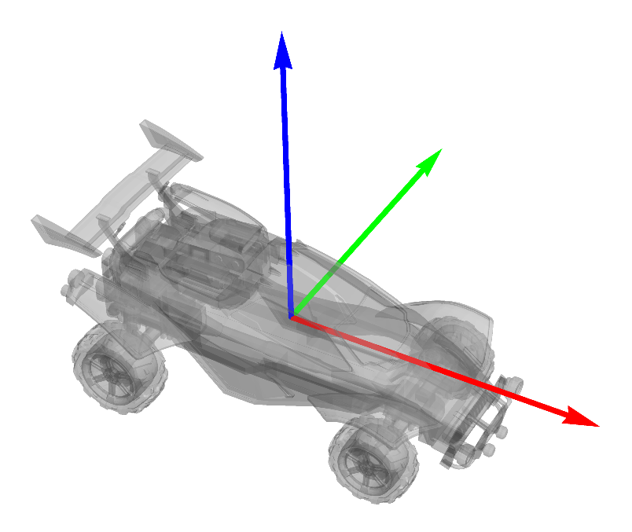
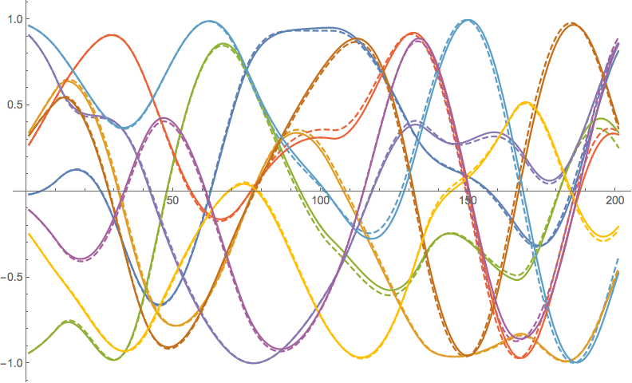
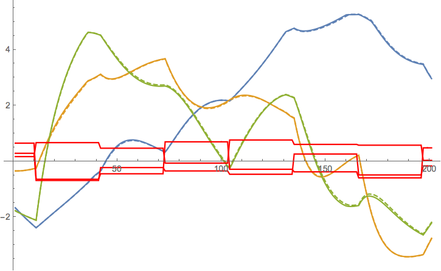
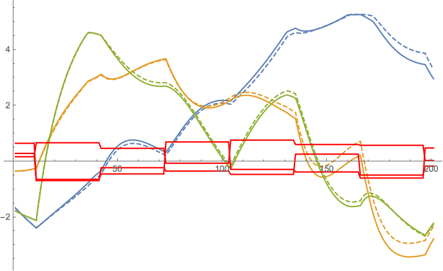
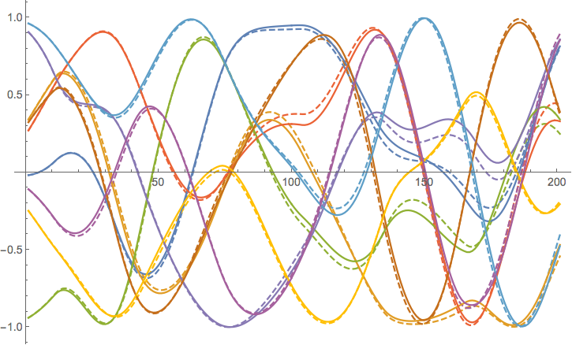

One of the first things we need to understand in order to write a bot for
Rocket League is how the controls we pass to the car affect what
it does. These notes provide an accurate model for predicting how
an airborn car will respond to the inputs we provide.

If you are not interested in any derivations, try skipping ahead to 
the [example implementation](#example-implementation).

## Problem Statement

Consider a scenario of a car in the air with
center of mass velocity $$\mathbf{v}$$, angular velocity 
$$\boldsymbol{\omega}$$, and orientation $$\boldsymbol{\Theta}$$.
At that instant, a player can influence the car by providing
inputs that exert torques on the car (to control its
rate of rotation), as well as boost. The car can also
air dodge, but we will save that mechanic for another
discussion.

While boosting, the car experiences an acceleration
in the direction of the front of the car. However,
as the car is tumbling through the air, this direction
is constantly changing, so how can we keep track of the
car's orientation?

### (aside) How does one represent orientation?

There is no ambiguity about how to represent velocity and angular velocity. $$\mathbf{v}$$ and
$$\boldsymbol\omega$$ are simply vectors in $$\mathbb{R}^3$$. Orientation, on the other hand, has a number of different
(but equivalent) common representations. Briefly,
three of the most common ways to represent an orientation
are:

1. Euler Angles: Orientation is parameterized by three angles, and an assumed order of application.
  The final orientation is achieved by applying the 3 rotations, in order. This is the representation
  that Rocket League uses internally.
2. Quaternions: In the same way that unit complex numbers are a natural representation of rotations in the plane, unit quaternions naturally can represent rotations in three dimensional space. 
3. Proper-Orthogonal Matrices: This representation uses a 3-by-3 matrix to store the local coordinate system associated with an orientation.

I choose to represent orientations directly in their matrix form.
Let $$\boldsymbol{f}, \boldsymbol{l}, \boldsymbol{u}$$ be the front,
left, and up directions for the car. They appear in the following way:

$$
\boldsymbol\Theta = 
\begin{bmatrix}
\color{red} f_x & \color{green} l_x & \color{blue} u_x \\
\color{red} f_y & \color{green} l_y & \color{blue} u_y \\
\color{red} f_z & \color{green} l_z & \color{blue} u_z
\end{bmatrix},
\qquad

\boldsymbol\Theta \; \boldsymbol\Theta^\top = \mathbf{1}
$$

### Time Rate of Change of Orientation

With that in mind, what happens to $$\boldsymbol\Theta$$
when it is subjected to a constant angular velocity
$$\boldsymbol\omega$$? It will rotate about $$\boldsymbol\omega$$'s axis
(shown in purple), at $$||\boldsymbol\omega||$$ radians per second:

<video autoplay loop muted>
<source type="video/webm" src="/videos/spinning.webm">
Your browser does not support the video element.
</video>

We can see that the time rate of the individual directions
$$\boldsymbol{f}, \boldsymbol{l}, \boldsymbol{u}$$ is given
by
$$
\displaystyle \frac{d\boldsymbol{f}}{dt} = \boldsymbol{\omega} \times \boldsymbol{f},
\qquad
\displaystyle \frac{d\boldsymbol{l}}{dt} = \boldsymbol{\omega} \times \boldsymbol{l},
\qquad
\displaystyle \frac{d\boldsymbol{u}}{dt} = \boldsymbol{\omega} \times \boldsymbol{u}
$$

or, in matrix form

$$
\displaystyle \frac{d\boldsymbol{\Theta}}{dt} = \boldsymbol{\Omega} \; \boldsymbol{\Theta},
\; \text{where} \;
\boldsymbol{\Omega} \; \boldsymbol{a} \; = \;
\begin{bmatrix}
0 & -\boldsymbol{\omega}_z & \boldsymbol{\omega}_y \\
\boldsymbol{\omega}_z & 0 & -\boldsymbol{\omega}_x  \\
-\boldsymbol{\omega}_y & \boldsymbol{\omega}_x & 0
\end{bmatrix}
\begin{bmatrix}
a_x \\ a_y \\ a_z
\end{bmatrix}
\; = \; \boldsymbol{\omega} \times \boldsymbol{a}, \;\; \forall \boldsymbol{a} \in \mathbb{R}^3
$$

This matrix-valued ordinary differential equation in $$\boldsymbol{\Theta}$$ might
look intimidating at first, but upon closer inspection, we can see that it is just
a matrix version of the simplest differential equation in mathematics:

$$
\big(\displaystyle \frac{dg}{dt} = a \; g, \;\; g(t_0) = g_0 \big)
\; \implies \; 
g(t_0 + \Delta t) = \exp(a \Delta t) \; g_0
$$

It follows that the solution to our matrix-valued ODE has a similar form

$$
\big(\displaystyle \frac{d\boldsymbol{\Theta}}{dt} = \boldsymbol{\Omega} \; \boldsymbol{\Theta},  \;\;
\boldsymbol{\Theta}(t_0) = \boldsymbol{\Theta}_0 \big)
\; \implies \;
\boldsymbol{\Theta}(t_0 + \Delta t) = \exp(\boldsymbol{\Omega} \Delta t) \; \boldsymbol{\Theta}_0
$$

Although most people are comfortable with the idea of taking the exponential of a number,
many have not seen the matrix exponential before, so I will quickly review what it means.
Fundamentally, the exponential function is defined by an infinite series:

$$ \exp(x) = 1 + x + \frac{x^2}{2!} + \frac{x^3}{3!} + ... $$

So, if we pass in a matrix argument, we get

$$
\exp(\boldsymbol{\Omega} \Delta t) = 
\boldsymbol{1} +\boldsymbol{\Omega} \Delta t +  
\displaystyle \frac{\boldsymbol{\Omega}^2 \Delta t^2}{2!} + 
\displaystyle \frac{\boldsymbol{\Omega}^3 \Delta t^3}{3!} + ... 
$$

In general, it can be tricky to evaluate the matrix exponential,
but luckily $$\boldsymbol{\Omega}$$ is an antisymmetric
matrix (i.e. $$\boldsymbol{\Omega} = - \boldsymbol{\Omega}^\top$$).
For antisymmetric matrices, we have a closed form expression
for the matrix exponential:

$$
\exp(\boldsymbol{\Omega} \Delta t) = 
\boldsymbol{1} + 
\frac{\sin(\phi)}{\phi} \boldsymbol{\Omega} \Delta t +  
\frac{1 - \cos(\phi)}{\phi^2} \boldsymbol{\Omega}^2 \Delta t^2,
\; \text{where} \;
\phi = ||\boldsymbol{\omega}|| \Delta t
$$

So, to summarize: if we know our orientation at time
$$t$$, and the time step is small enough that 
$$\boldsymbol{\omega}$$ is approximately constant over
the time interval, then the new orientation is given by:

$$
\boldsymbol{\Theta}(t + \Delta t) \coloneqq
\bigg(
\boldsymbol{1} + 
\displaystyle \frac{\sin(\phi))}{\phi} \boldsymbol{\Omega} \Delta t +
\frac{1 - \cos(\phi)}{\phi^2} \boldsymbol{\Omega}^2 \Delta t^2
\bigg) \boldsymbol{\Theta}(t)
$$

To verify, I recorded some data from Rocket League, where a car
was tumbling with randomized inputs. This test predicts
future car orientations, given the initial orientation of the car, 
and the exact (recorded) time history of angular velocities. Each
of the 9 predicted entries (dashed lines) of the orientation matrix 
are plotted against their exact versions (solid lines) below:

Here, we see that the predicted values provide a reasonable approximation of the orientation, with some error. Comparing predicted and exact
orientations at the final time step in this example shows that the
two are off by a rotation of 5.92345 degrees. 

From my experiments, it is noticeably more true-to-Rocket League to use the
averaged angular velocity when evaluating the update procedure
above:

$$
\text{use} \; \boldsymbol{\omega} \coloneqq \frac{1}{2}
\big( \boldsymbol{\omega}(t) + \boldsymbol{\omega}(t + \Delta t) \big) 
$$

But to get the $$\boldsymbol{\omega}(t + \Delta t)$$ for this
averaged angular velocity, we need to consider how 
$$\boldsymbol{\omega}$$ evolves with time.

## Time Rate of Change of Angular Velocity

Now that we understand how to predict $$\boldsymbol{\Theta}(t + \Delta t)$$, 
given $$\boldsymbol{\omega}(t)$$ and $$\boldsymbol{\Theta}(t)$$, we need a
way to compute $$\boldsymbol{\omega}(t + \Delta t)$$. We start with the
rotational analogue of Newton's second law (for rotations about the
center of mass of an object):

$$
\frac{d(\boldsymbol{I}\boldsymbol{\omega})}{dt} = 
\boldsymbol{\tau} - \boldsymbol{\omega} \times (\boldsymbol{I} \boldsymbol{\omega})
$$

where $$\boldsymbol{I}$$ is the car's moment of inertia, and
$$\boldsymbol{\tau}$$ is the net torque applied on the car.
In reality, the moment of inertia for an interesting shape
like a car would be a 3x3 tensor with at least 3 unique
entries. However, since there is no reason to believe that
Rocket League is interested in realistic simulation, my first
analysis is one where we consider the case where 
$$\boldsymbol{I} = \mathbf{1}$$ (i.e., the car has no
direction in which it is harder or easier to rotate). In this
case, the term $$\boldsymbol{\omega} \times (\boldsymbol{I} \boldsymbol{\omega})$$
vanishes, and we are left with just

$$ \frac{d(\boldsymbol{\omega})}{dt} = \boldsymbol{\tau} $$

At this point, it is a matter of understanding how Rocket League
calculates $$\boldsymbol{\tau}$$ in terms of the user's input
and the current orientation. Empirically, the following 
expression gives good results:

$$
\boldsymbol{\tau} = 
\boldsymbol{\Theta} \; (
\boldsymbol{T} \; \boldsymbol{u} + 
\boldsymbol{D} \; \boldsymbol{\Theta}^\top \; \boldsymbol{\omega}),
\; \text{where} \;
\boldsymbol{u} = \begin{bmatrix}
u_r \\ u_p \\ u_y
\end{bmatrix} = \begin{bmatrix}
\text{(input roll)} \\
\text{(input pitch)} \\
\text{(input yaw)}
\end{bmatrix}
$$

with

$$
\boldsymbol{T} = \begin{bmatrix}
T_r & 0 & 0 \\
0 & T_p & 0 \\
0 & 0 & T_y
\end{bmatrix},
\qquad
\boldsymbol{D} = \begin{bmatrix}
D_r & 0 & 0 \\
0 & D_p (1 - |u_p|) & 0 \\
0 & 0 & D_y (1 - |u_y|) 
\end{bmatrix}
$$

with numerical values for $$T_r, T_p, T_y, D_r, D_p, D_y$$ given
in the example implementation. Note: the matrix $$\boldsymbol{D}$$
treats rotations in the "roll"-direction differently than the "pitch" and
"yaw" directions. This means that when a user inputs a pitch or yaw
of $$\pm 1$$, the damping in those directions is turned off. However,
the damping torque in the "roll" direction is always on.

Finally, we can update $$\boldsymbol{\omega}$$:

$$ \boldsymbol{\omega}(t +\Delta t) = \boldsymbol{\omega}(t) + \boldsymbol{\tau} \Delta t$$

Applying this procedure to the same dataset as before, this time with exact values for
$$\boldsymbol{\Theta}$$ (which is needed to evaluate $$\boldsymbol{\tau}$$), 
we get very good agreement between predicted angular velocities (dashed lines) 
and exact values (solid lines). The red traces show the three components of 
input roll, pitch, and yaw, with their transitions.

The fact that the plots are nearly identical here is evidence
that our assumption about the moment of inertia is not unreasonable.
Furthermore, I briefly investigated what effect a
realistic moment of inertia would have and found that the
moment of inertia values that produced the best predictions
were those of an isotropic tensor (which was our original assumption).

## Final notes

For the example comparisons, we made predictions about 
$$\boldsymbol{\Theta}$$ using exact values for $$\boldsymbol{\omega}$$, and
used exact values of $$\boldsymbol{\Theta}$$ to predict $$\boldsymbol{\omega}$$. In
a realistic scenario, we will not have those exact values, and we must use
only the initial orientation and angular velocity. This means that we go back
and forth, updating $$\boldsymbol{\Theta}$$ in order to update 
$$\boldsymbol{\omega}$$, in order to update $$\boldsymbol{\Theta}$$ again and so on. 
This means that errors accumulate more rapidly, as shown below (using only exact
initial conditions for $$\boldsymbol{\Theta}$$, $$\boldsymbol{\omega}$$):

Angular velocity:

Orientation:

Of these two predictions, it seems to be the case that the
orientation update is the main source of error. This may be
related to Rocket League's internal representation of 
orientation as Euler angles quantized to 16-bit integers.

With all of this information, we can try to figure out inputs that
produce a desired car orientation for aerial hits,
shots, and the recovery afterward.

## Example Implementation

~~~cpp
const float omega_max = 5.5;
const float T_r = -36.07956616966136; // torque coefficient for roll
const float T_p = -12.14599781908070; // torque coefficient for pitch
const float T_y =   8.91962804287785; // torque coefficient for yaw
const float D_r =  -4.47166302201591; // drag coefficient for roll
const float D_p = -2.798194258050845; // drag coefficient for pitch
const float D_y = -1.886491900437232; // drag coefficient for yaw

struct state {
  vec3   omega; // angular velocity
  mat3x3 theta; // orientation
};

state aerial_control(state current, float roll, float pitch, float yaw, float dt) {
   
  mat3x3 T{
    {T_r, 0.0, 0.0},
    {0.0, T_p, 0.0},
    {0.0, 0.0, T_y}
  }; 

  mat3x3 D{
    {D_r, 0.0, 0.0},
    {0.0, D_p (1.0 - fabs(pitch)), 0.0},
    {0.0, 0.0, D_y (1.0 - fabs(yaw))}
  };
  
  // compute the net torque on the car
  vec3 tau = dot(D, dot(transpose(current.theta), current.omega));
  tau += dot(T, vec3{roll, pitch, yaw}));
  tau = dot(current.theta, tau));

  // use the torque to get the update angular velocity
  vec3 omega_next = current.omega + tau * dt;  

  // prevent the angular velocity from exceeding a threshold
  omega_next *= fmin(1.0, omega_max / norm(omega));

  // compute the average angular velocity for this step
  vec3 omega_avg = 0.5 * (current.omega + omega_next);
  float phi = norm(omega_avg) * dt;

  mat3x3 Omega_dt = {
    {0.0, -omega_avg[2] * dt, omega_avg[1] * dt},
    {omega_avg[2] * dt, 0.0, -omega_avg[0] * dt},
    {-omega_avg[1] * dt, omega_avg[0] * dt, 0.0}
  };

  mat3x3 R = mat3x3::eye();
  R += (sin(phi) / phi) * Omega_dt;
  R += (1.0 - cos(phi)) / (phi*phi) * dot(Omega_dt, Omega_dt);

  return state{omega_next, dot(R, current.theta)};
   
}
~~~

also, to convert from Euler angles (in radians) to an orientation matrix:

~~~cpp

mat3x3 convert_from_Euler_angles(float roll, float pitch, float yaw) {

  float CR = cos(roll);
  float SR = sin(roll);
  float CP = cos(pitch); 
  float SP = sin(pitch);
  float CY = cos(yaw);
  float SY = sin(yaw);

  mat3x3 theta;

  // front direction
  theta(0, 0) = CP * CY;
  theta(1, 0) = CP * SY;
  theta(2, 0) = SP; 

  // left direction
  theta(0, 1) = CY * SP * SR - CR * SY;
  theta(1, 1) = SY * SP * SR + CR * CY;
  theta(2, 1) = -CP * SR; 

  // up direction
  theta(0, 2) = -CR * CY * SP - SR * SY; 
  theta(1, 2) = -CR * SY * SP + SR * CY;
  theta(2, 2) = CP * CR; 

  return theta; 

}
~~~

