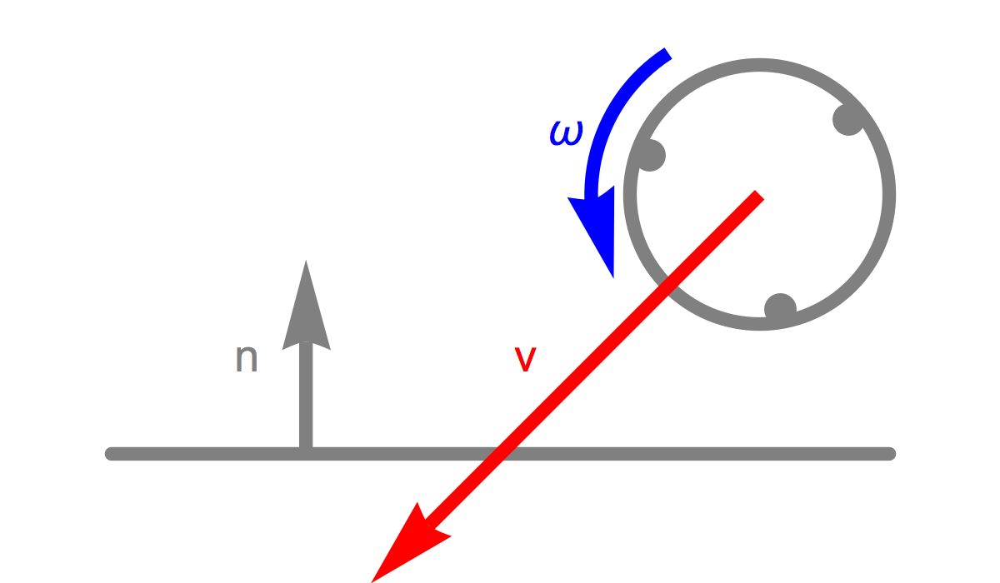
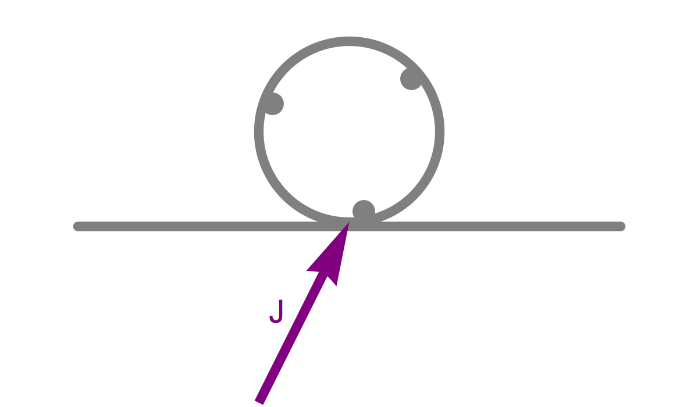
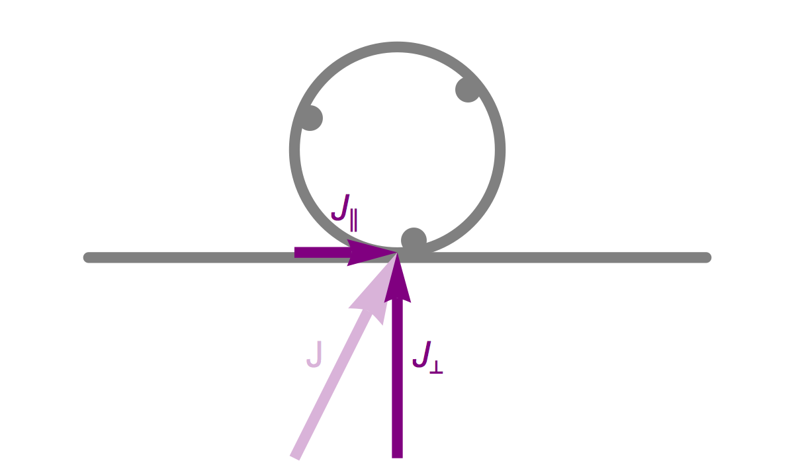
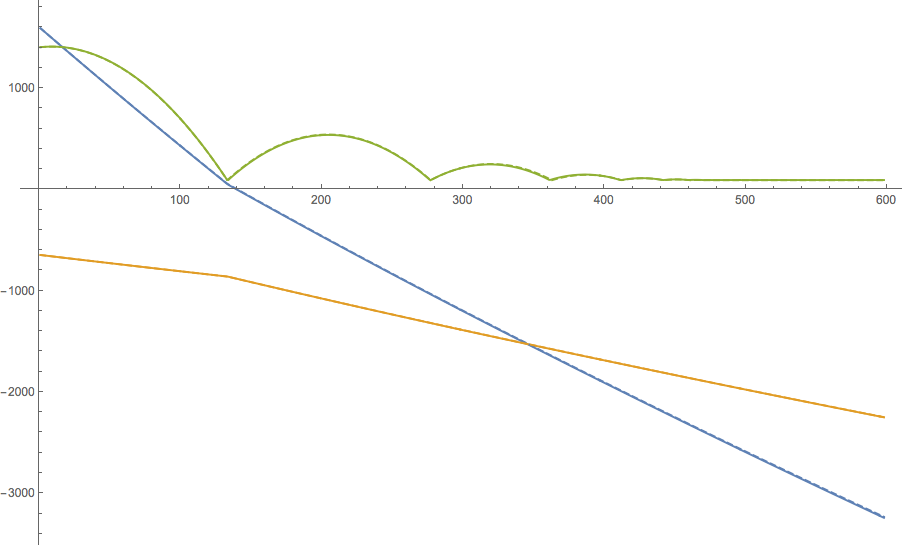
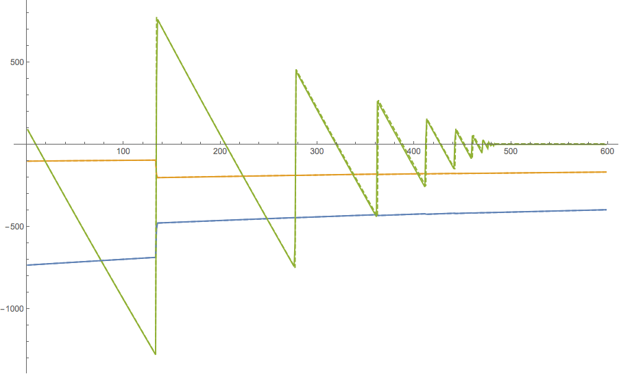
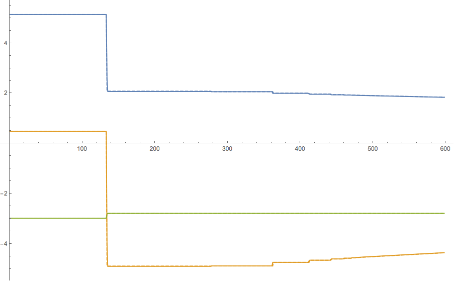

A good Rocket League bot needs to understand where the ball is going
in order to plan what to do. These notes summarize the basic
rigid body physics that we need to accurately predict the ball's
trajectory.

If you are not interested in any derivations, try skipping ahead to 
the [example implementation](#example-implementation), 
and [see it in action](#example-predictions). 

## Problem Statement

Consider a scenario where a ball with radius $$R$$ is about to make 
contact with a rigid surface with unit normal vector $$\mathbf{n}$$. 
Let $$\mathbf{v}$$ be the velocity of the center of mass of the ball, 
and $$\boldsymbol{\omega}$$ be the angular velocity of the ball.

When the ball comes into contact with the rigid surface,
it feels an impulse $$\mathbf{J}$$ that redirects the ball
away from the surface:

To make our calculations work for any surface orientation,
we need to express the impulse in terms of its components
parallel to the surface, $$\mathbf{J}_{\shortparallel}$$,
and normal to it, $$\mathbf{J}_{\perp}$$

If we knew these components of $$\mathbf{J}$$, then we could update
the ball's velocity and angular velocity:

$$
\begin{cases}
  \mathbf{v} \coloneqq \mathbf{v} + \displaystyle \frac{\mathbf{J}}{m} \\ \\
  \boldsymbol{\omega} \coloneqq \boldsymbol{\omega} + \displaystyle \frac{R}{I} (\mathbf{J}_{\shortparallel} \times \mathbf{n})
\end{cases}
$$

where $$m$$ and $$I$$ are the ball's mass and moment of inertia (which, for a sphere,
can be represented by a scalar value), respectively. Note:
since the line of action of $$\mathbf{J}_{\perp}$$ goes through the center of mass of
the ball, it produces no torque. This is why the update procedure for 
$$\boldsymbol{\omega}$$ only involves $$\mathbf{J}_{\shortparallel}$$.

All we need now is a model for how to determine $$\mathbf{J}_{\shortparallel}$$
and $$\mathbf{J}_{\perp}$$.

## Normal Impulse

This is the simpler of the two components to figure out. In order to ensure
that the ball's corrected velocity will be moving away from the wall, we use
the following model

$$
  \mathbf{J}_{\perp} = - \; m \; (1 + C_R) \; \mathbf{v}_{\perp}
  \qquad \text{where  }
  \mathbf{v}_{\perp} = (\mathbf{v} \cdot \mathbf{n}) \; \mathbf{n}
$$

Here, $$C_R$$ is the coefficient of restitution, a number between 0 and 1
that characterizes how much the ball rebounds off of the surface. 
Empirically, a value of $$C_R \approx 0.6$$ seems to be a good approximation
for Rocket League.

## Tangential Impulse

The tangential impulse is related to frictional effects during the
moment of contact. There are a number of different frictional models 
that are commonly used, so it is more challenging to reverse engineer
the one being used in Rocket League. Consider the following animation
(made from actual data recorded in Rocket League):

<video autoplay loop muted>
<source type="video/webm" src="/videos/bounce.webm">
</video>

The important observation here is that the ball is subjected to a 
tangential impulse when colliding with the ground, even though
its horizontal velocity was initially zero. This indicates that
the friction model must be one that opposes the slip velocity, 
$$\mathbf{s}$$, at the point of contact, rather than just the velocity
of the ball's center of mass. 

Since the surfaces are not moving, 
the slip velocity is just the velocity of the part of the ball 
that makes contact with the surface. Like the animation shows,
this slip velocity depends on both the ball's angular velocity
and the velocity of its center of mass:

$$
  \mathbf{s} = \mathbf{v}_{\shortparallel} + 
    R \; (\mathbf{n} \times \boldsymbol{\omega}),
  \qquad \text{where  }
  \mathbf{v}_{\shortparallel} = \mathbf{v} - (\mathbf{v} \cdot \mathbf{n}) \; \mathbf{n}
$$ 

The simplest friction model of this type is one that opposes the slip velocity, linearly:

$$
  \mathbf{J}_{\shortparallel} = - \; m \; 
    \min(1, \;\; Y \; \frac{||\mathbf{v}_{\perp}||}{||s||}) 
    \; \mu \; \mathbf{s}
  \qquad \text{where  }
  ||\mathbf{a}|| = \sqrt{\mathbf{a} \cdot \mathbf{a}}
$$

## Final notes

Although these expressions include the mass $$m$$ and moment of
inertia $$I$$, we can't directly measure these values from observations
of a ball bouncing. Luckily, it turns out we don't need to know their
values to make accurate predictions about the dynamics of the ball.

This provides the description of how to update the ball's velocity and
angular velocity, but to make good predictions we also need an appropriate
time integrator, and a way to detect which surfaces the ball hits.

## Example Implementation

~~~cpp
const double R = 91.25;
const double Y = 2.0;
const double mu = 0.285;
const double C_R = 0.6;
const double A = 0.0003;

struct state {
  vec3 x; // position
  vec3 v; // velocity
  vec3 w; // angular velocity
};

state bounce(state current, vec3 n) {
   
  vec3 v_perp = dot(current.v, n) * n;
  vec3 v_para = current.v - v_perp;
  vec3 v_spin = R * cross(n, current.w);
  vec3 s = v_para + v_spin;
   
  double ratio = length(v_perp) / length(s);
   
  vec3 delta_v_perp = - (1.0 + C_R) * v_perp;
  vec3 delta_v_para = - fmin(1.0, Y * ratio) * mu * s;
   
  return state{
    current.x,
    current.v + delta_v_perp + delta_v_para,
    current.w + A * R * cross(delta_v_para, n)
  };  
   
}
~~~

## Example Predictions

These plots compare actual ball trajectories recorded in Rocket
League (solid lines) to the predicted trajectories computed with
this model of ball bounce physics, given only the initial conditions
(dashed lines). These plots are generated from data file 
"episode\_000218.csv" in the dataset provided at the top of this page.

Ball locations, as a function of time step:

Ball velocities, as a function of time step:

Ball angular velocities, as a function of time step:

Note: in real time, 600 steps is about 10 seconds. The following
are numerical values for the state after 10 seconds of prediction (quantities
with a tilde), compared to their exact values (quantities without tilde):

$$
\mathbf{x} = 
\begin{bmatrix}
-3242.75 \\ -2250.18 \\ 93.15
\end{bmatrix}, \qquad
\mathbf{\tilde{x}} = 
\begin{bmatrix}
-3232.98 \\ -2248.68 \\ 91.2911
\end{bmatrix}, \qquad
$$

$$
\mathbf{v} = 
\begin{bmatrix}
-397.097 \\ -167.692 \\ 0.0
\end{bmatrix}, \qquad
\mathbf{\tilde{v}} = 
\begin{bmatrix}
-397.489 \\ -167.986 \\ 3.99011
\end{bmatrix}, \qquad
$$

$$
\boldsymbol{\omega} = 
\begin{bmatrix}
1.83772 \\ -4.35171 \\ -2.7843
\end{bmatrix}, \qquad
\boldsymbol{\tilde{\omega}} = 
\begin{bmatrix}
1.84095 \\ -4.35605 \\ -2.78952
\end{bmatrix}, \qquad
$$

So, it is possible to predict the ball's motion many seconds in advance, 
with accurate results. Other improvements are still possible, as it
looks like Rocket League may explicitly zero out vertical velocity when 
rolling, etc. 
