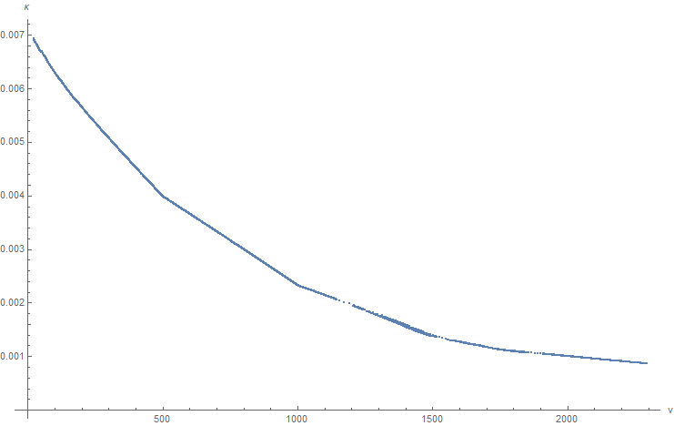
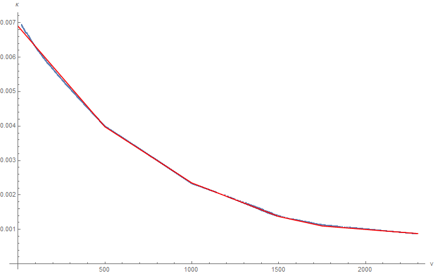
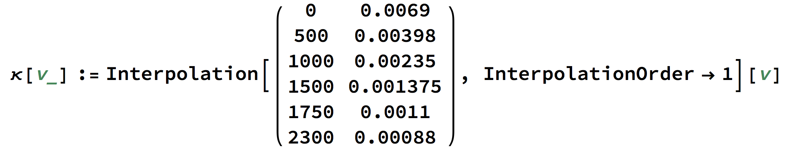
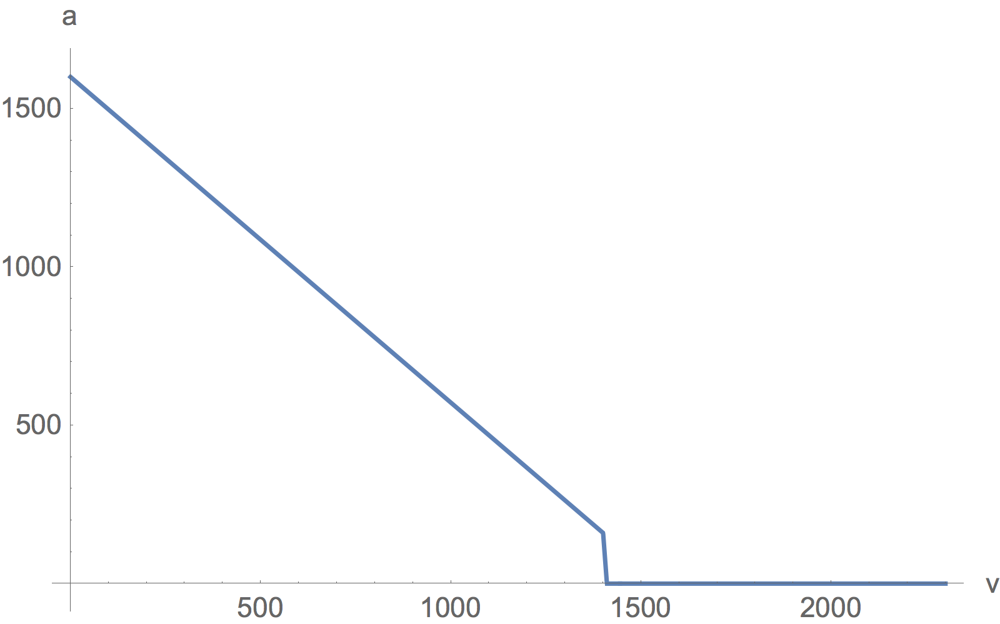
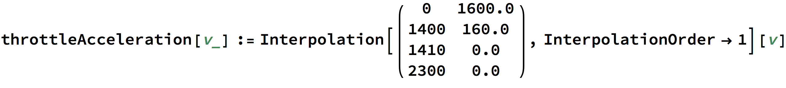

## Overview

When driving on the ground, the user controls their car by 
setting values for throttle, steering, boost, and powerslide (ignored 
for this post). We are interested in predicting how the car
will respond to these inputs, so that we can answer questions like:

- can my car reach a particular destination in time?
- how much boost will it take to reach this destination?
- how fast will I be going when I arrive?
- can I reach the ball before my opponent?

This article presents a brief overview of some of the mechanics
of driving, so that we might be able to answer (at least approximately)
some of questions above.

### Turning

Consider what happens when we steer all the way to the left
and increase the car's throttle:

<video autoplay loop muted width="640">
<source type="video/webm" src="turning_radius.webm">
</video>

If we look closely, we can see that the front wheels change direction
as we accelerate (steering is kept constant). Specifically, the wheels
tend to straighten out as the car's speed increases. This means that the
car turns more tightly when it is moving slowly (or, that the turning
radius gets bigger as it speeds up). 

To quantify this effect, the car's steering was set to maximum, and
the curvature of its trajectory ($$\kappa \propto \frac{1}{r}$$) was 
logged along with its velocity. The data points are shown below:

From this, we see that the curvature seems to vary in a piecewise linear
way with respect to velocity. We can fit a function to this data (shown
in red), and use it to predict rates of turning:

The Mathematica implementation of the red piecewise linear function above 
is given below:

Where the first column of numbers are the velocities, the second column
are the curvature values, and the function interpolates between any
two points with a line.

Additional tests revealed that the curvature of turning is also roughly
proportional to the steering input value. For example, this means that 
if you want to follow a path with half the maximum curvature predicted
by the function above, then steering should set to approximately 0.5,
and so on.

### Acceleration

How quickly the car accelerates depends on its current velocity, and the
throttle and boost inputs. The sections below describe the time rate of 
the forward component of the car's velocity in each case. 

#### Braking

If the sign of the car's forward velocity is opposite from the sign of the input throttle, 
then the car experiences a constant acceleration of $$ 3500 \frac{uu}{s^2} $$ opposing its
current velocity.

#### Coasting

If the car's input throttle is small enough (less than about 0.01 in absolute value), then
the car experiences a constant acceleration, slowing it down at a rate of $$525 \frac{uu}{s^2}$$.

#### Throttle

The acceleration due to throttle is velocity dependent. It is greatest when the car is at rest,
and then decreases monotonically to zero when traveling at $$1410 \frac{uu}{s}$$. 

The numbers for this curve are given below, again with the first column being the velocities,
and the second column the accelerations:

Note: if you want to maintain your current speed, it is better to use a small, positive throttle value (say, 0.02)
as opposed to zero, since a throttle of 0.0 will make the car experience the relatively large coasting acceleration.

#### Boost

When boost is active, the throttle value is essentially forced to 1.0, and an additional $$991.667 \frac{uu}{s^2}$$ is
applied as well.

Note: this means that if you're moving backwards and you start to boost, you will experience an acceleration of about
$$(3500 + 991.667) \frac{uu}{s^2}$$ in the forward direction (braking acceleration from forcing throttle to 1.0 as well
as the additional boost acceleration).

#### Gravity

Gravity affects the car when driving just as much as it does when the car is airborn. The effect this has on the car is
an additional acceleration with value $$ \boldsymbol{g} \cdot \boldsymbol{f} $$, where $$ \boldsymbol{g} $$ is
the gravitational acceleration (with magnitude $$650 \frac{uu}{s^2}$$), and $$\boldsymbol{f}$$ is the unit vector along
the direction the car is facing.
