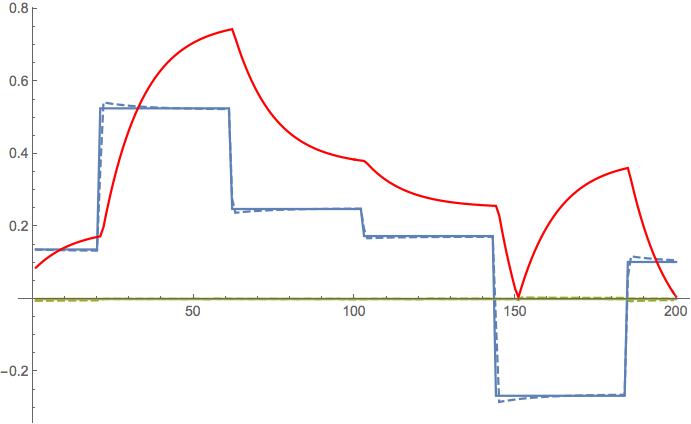

This is a continuation of a [previous post](/rocket_league/aerial_control/),
to demonstrate how to solve the inverse problem of determining
user input from trajectories.

## Problem Statement

Say we know that, at a particular instant in time, a user was
controlling a vehicle in the air (without being hit by another
car, or air dodging). Is it possible to use information about the car's
dynamic state to determine what inputs the users issued?

Let's take a look: from the previous post, we have the following update
procedure for the angular velocity:

$$
\boldsymbol{\omega}(t + \Delta t) := 
\boldsymbol{\omega}(t) + \boldsymbol\tau \Delta t
$$

If we knew what the beginning and end step values of
$$\boldsymbol{\omega}$$ were, then we know what
$$\boldsymbol{\tau}$$ must have been:

$$
\boldsymbol{\tau} = \frac{
\boldsymbol{\omega}(t + \Delta t) - 
\boldsymbol{\omega}(t)
}{\Delta t}
$$

furthermore, by using our expression for $$\boldsymbol{\tau}$$
in the other post, we can say that

$$
\boldsymbol{\tau} = 
\boldsymbol{\Theta}(t) \; (
\boldsymbol{T} \; \boldsymbol{u} + D(\boldsymbol{u}) \;
\boldsymbol{\Theta}(t)^\top \; \boldsymbol{\omega(t)}
)
$$

where $$\boldsymbol{u}$$ is the vector of user inputs
(roll, pitch, yaw) that we seek. The definition of
$$\boldsymbol{D}(\boldsymbol{u})$$ involves absolute
values of components of $$\boldsymbol{u}$$, making the
equations nonlinear: 

$$
\begin{alignedat}{2}
T_r \, & u_r                &= \tau_r - D_r \, \omega_r \\ 
T_p \, & u_p - D_p \, |u_p| &= \tau_p - D_p \, \omega_p \\ 
T_y \, & u_y - D_y \, |u_y| &= \tau_y - D_y \, \omega_y
\end{alignedat}
\;\; \text{where} \;\;
\tilde{\boldsymbol{\tau}} = \begin{bmatrix}
\tau_r \\ \tau_p \\ \tau_y
\end{bmatrix} = \boldsymbol{\Theta}^\top \boldsymbol{\tau},
\;\;
\tilde{\boldsymbol{\omega}} = \begin{bmatrix}
\omega_r \\ \omega_p \\ \omega_y
\end{bmatrix} = \boldsymbol{\Theta}^\top \boldsymbol{\omega}
$$

Thankfully, they are decoupled, so they can be solved individually:

Roll:
$$
u_r = \displaystyle \frac{\tau_r - D_r \; \omega_r}{T_r}
$$

Pitch:
$$
u_p = \displaystyle \frac{\tau_p - D_p \; \omega_p}{T_p + \text{sgn}(\tau_p - D_p \; \omega_p) \omega_p D_p}
$$

Yaw:
$$
u_y = \displaystyle \frac{\tau_y - D_y \; \omega_y}{T_y - \text{sgn}(\tau_y - D_y \; \omega_y) \omega_y D_y}
$$

Where $$\text{sgn}$$() is the [signum function](https://en.wikipedia.org/wiki/Sign_function). 
Ideally, these values will always be in the range (-1, 1), but to get the best admissible
input in weird cases, do the following as well:

$$ 
\begin{aligned}
u_r &\coloneqq u_r \; \min(1.0, \frac{1}{|u_r|}) \\
u_p &\coloneqq u_p \; \min(1.0, \frac{1}{|u_p|}) \\
u_y &\coloneqq u_y \; \min(1.0, \frac{1}{|u_y|}) \\
\end{aligned}
$$

## Dealing with a Maximum Angular Speed

If the norm of angular velocity exceeds 5.5, Rocket League 
scales it back down, until it is 5.5. How does this affect our
ability to guess the inputs of a trajectory?

In short, this means there will be more than one net torque
$$\boldsymbol\tau$$ that produces identical end-step angular
velocities. As a result, there can be cases where there are
infinitely many possible inputs that produce the same 
aerial trajectory. The procedure described above will still
work, and will find the inputs that produce the torque 
of minimum magnitude that yields the appropriate end-step
angular velocity!

## Example Problem

These examples show how well the recovered user
input (dashed lines) compares to the exact values (solid
lines). The trace in red is the norm of the angular velocity--
note that when it hits 5.5, the inputs do not coincide.
However, it is the case that the exact inputs and the
recovered would still have the same effect on the car.

An example where angular velocities do not clip shows
almost exact agreement:

## Possible Implementation

~~~cpp
const float T_r = -36.07956616966136; // torque coefficient for roll
const float T_p = -12.14599781908070; // torque coefficient for pitch
const float T_y =   8.91962804287785; // torque coefficient for yaw
const float D_r =  -4.47166302201591; // drag coefficient for roll
const float D_p = -2.798194258050845; // drag coefficient for pitch
const float D_y = -1.886491900437232; // drag coefficient for yaw

float sgn(float x) {
  return return (0.0f < x) - (x < 0.0f);
}

vec3 aerial_inputs(
    vec3 omega_start, 
    vec3 omega_end,
    mat3x3 theta_start,
    float dt) {

  // net torque in world coordinates
  vec3 tau = (omega_end - omega_start) / dt; 

  // net torque in local coordinates
  tau = dot(transpose(theta_start), tau);

  // beginning-step angular velocity, in local coordinates
  vec3 omega_local = dot(transpose(theta_start), omega_start);

  vec3 rhs{
    tau[0] - D_r * omega_local[0],
    tau[1] - D_p * omega_local[1],
    tau[2] - D_y * omega_local[2]
  };

  // user inputs: roll, pitch, yaw
  vec3 u{
    rhs[0] / T_r,
    rhs[1] / (T_p + sgn(rhs[1]) * omega_local[1] * D_p),
    rhs[2] / (T_y - sgn(rhs[2]) * omega_local[2] * D_y)
  };

  // ensure that values are between -1 and +1 
  u[0] *= fmin(1.0, 1.0 / fabs(u[0]));
  u[1] *= fmin(1.0, 1.0 / fabs(u[1]));
  u[2] *= fmin(1.0, 1.0 / fabs(u[2]));

  return u; 

}
~~~
