This post aims to describe an accurate,
quantitative description of the physics behind the collisions
of Rocket League, so that players and bot developers might 
better understand what happens when the car and ball make contact.
It is my hope that this theory will allow bots to make
more informed decisions about their shot selection,
so we can finally say "Calculated." unironically!

Although these notes are presented on this personal website,
this work is a collaboration with Nevercast
and tarehart (both members of the [RLBot community](https://www.rlbot.org)).
Additionally, I also want to express my thanks to Bakkes for developing
[tools](https://www.bakkesmod.com) that greatly simplified the data collection process for this analysis.

## Hitboxes and Collision Detection

Rocket League doesn't use the actual car's geometry to determine when 
collisions take place, instead they use oriented bounding boxes (OBBs)
for each preset type:

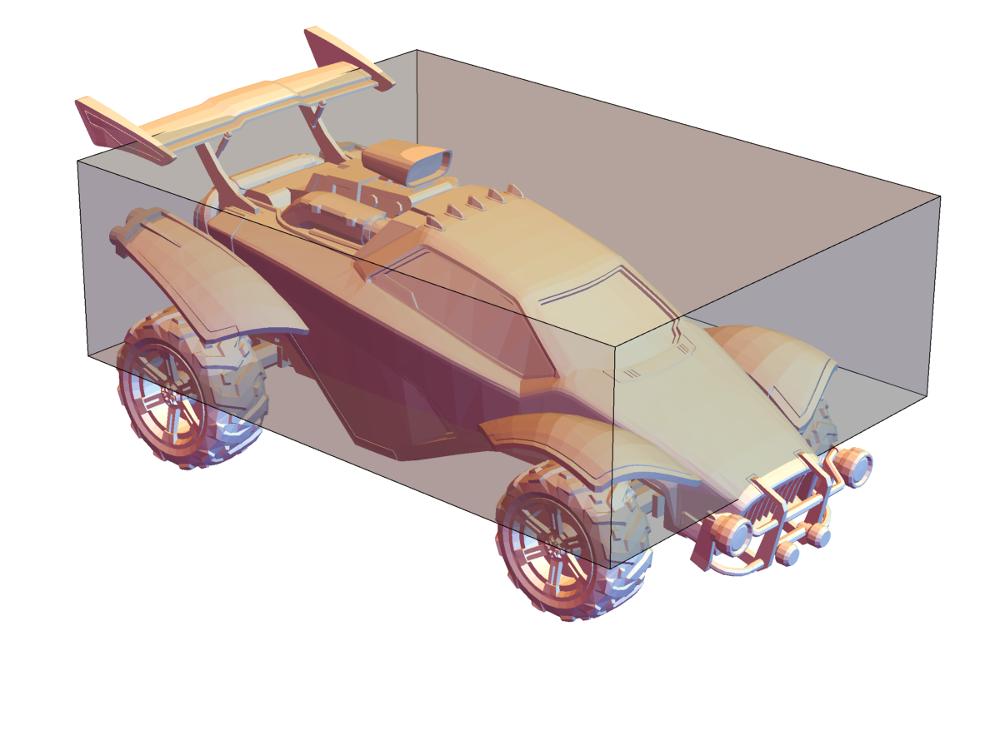

Although this geometry doesn't really match the car very well, it is convenient
from a programming perspective because it is inexpensive to perform intersection
tests on this simple shape. In particular, we can determine if a sphere is 
contacting the oriented bounding box by first finding the point on the OBB
that is closest to the sphere's center, and then 
check if the distance between those points is less than the radius.

<video autoplay loop muted>
<source type="video/webm" src="obb_nearest_point.webm">
Your browser does not support the video element.
</video>

For a general shape, it can be pretty challenging
to find the point on that shape that has the least distance to
another point of interest. Fortunately, the orthogonality of
the face normals on the OBB make it so we can find that nearest
point in only a few lines of code. 

Here's one possible implementation of a way to find that nearest point:

~~~cpp
struct sphere{
  vec3 center;
  float radius;
};

struct obb{
  vec3 center;
  vec3 half_width;
  mat3 orientation;
};

vec3 nearest_point_on_obb(const obb & a, const vec3 b) {

  // get the local coordinates of b
  vec3 b_local = dot(b - a.center, a.orientation);

  // clip those coordinates to find the closest point (in local coordinates)
  vec3 closest_local = vec3{
    fminf(fmaxf(b_local[0], -a.half_width[0]), a.half_width[0]),
    fminf(fmaxf(b_local[1], -a.half_width[1]), a.half_width[1]),
    fminf(fmaxf(b_local[2], -a.half_width[2]), a.half_width[2])
  };

  // transform back to world coordinates
  return dot(a.orientation, closest_local) + a.center;

}

bool intersect(const obb & a, const sphere & b) {
  vec3 p = nearest_point_on_obb(a, b.center);
  return (norm(p - b.center) <= b.radius);
}

~~~

Detailed information about hitbox dimensions and offsets for each preset type can be found 
[here](https://onedrive.live.com/view.aspx?resid=F0182A0BAEBB5DFF!14583&ithint=file%2cxlsx&app=Excel&authkey=!ALu0cMkDZDoWOws), courtesy of halfwaydead. Additionally, [his video on hitboxes](https://www.youtube.com/watch?v=Ymv_ARs33rY) (and everything else on his channel) is also highly recommended.

Now that we have a way to detect when a collision happens, how does it affect the trajectory of the ball?

## Relevant Physics of Rigid Body Collisions

If a car collides with the ball, we need to know quite of information about them if we're going to predict the outcome of the collision:

Properties we'll need to know:
- $$m$$ (mass)
- $$\boldsymbol{I}$$ (moment of inertia)
- $$\boldsymbol{x}$$ (position / pivot point)
- $$\boldsymbol{v}$$ (velocity)
- $$\boldsymbol{\Theta}$$ (orientation matrix)
- $$\boldsymbol{\omega}$$ (angular velocity)

Some other useful notation:
- $$\boldsymbol{J}$$ (impulse)
- $$\boldsymbol{L}$$ (cross-product matrix satisfying 
$$\boldsymbol{L}\boldsymbol{y} = (\boldsymbol{p} - \boldsymbol{x}) \times \boldsymbol{y}$$)

A symbol's subscript will be used to distinguish between quantities belonging to the car and ball (either 'c' for car or 'b' for ball). e.g. $$\boldsymbol{\Theta}_c$$ will be the car's orientation matrix,  $$\boldsymbol{\omega}_b$$ will be the ball's angular velocity, and so on. Symbols in bold represent vectors or matrices (e.g. $$\mathbf{1}$$ is the identity matrix, not the number 1), and all other symbols are scalars.

When objects collide, they exert (equal and opposite) forces on each other to prevent interpenetration. In general, there can be many points of contact (each with its own force), but the problem we care about is simple: a sphere hitting a box. In this case, the contact can be reasonably approximated by a force applied a single point. If we knew that force, $$\boldsymbol{F}$$, was applied to a rigid body at point $$\boldsymbol{p}$$ for a duration $$\Delta t$$, then the rigid body would respond in the following way (where quantities with a tilde are the post-collision values, and $$\boldsymbol{J} = \boldsymbol{F} \Delta t$$):

$$
\begin{cases}
  \boldsymbol{\tilde{v}} = \boldsymbol{v} + m^{-1} \boldsymbol{J} \\ \\
  \boldsymbol{\tilde{\omega}} = \boldsymbol{\omega} + \boldsymbol{I}^{-1} \big[
      (\boldsymbol{p} - \boldsymbol{x}) \times \boldsymbol{J} \big] = 
      \boldsymbol{\omega} + \boldsymbol{I}^{-1} \boldsymbol{L} \; \boldsymbol{J}
\end{cases}
\tag{1}
$$

So, the velocity change only depends on the impulse itself, not where it is applied.
In contrast, the change in angular velocity cares about where that force is being applied,
and the matrix $$\boldsymbol{L}$$ represents the "lever arm".

All that remains is to find an expression that tells us how to compute the appropriate
value of $$\boldsymbol{J}$$ and we can use the equation above to figure out what the
ball will be doing after the collision.

In Rocket League, this $$\boldsymbol{J}$$ is actually made up of two separate
contributions: one from the game's underlying physics engine, and
one that Psyonix added to make the game more predictable and fun. The
following sections below describe how to calculate those different contributions.

## A Model of the Physics Engine Impulse

This impulse from the physics engine is modeled as coming from an 
inelastic rigid-body collision with Coulomb friction. 

Intuitively, the 'inelastic collision' part of the model 
means that the impulse $$\boldsymbol{J}$$ will be determined such 
that the post-collision surface velocities at $$\boldsymbol{p}$$ 
of the two bodies are the same. The surface velocity, $$\boldsymbol{V}$$ at 
$$\boldsymbol{p}$$ depends on the object's velocity, as well as how fast it is spinning:

$$
\boldsymbol{V} = 
\boldsymbol{v} + \boldsymbol{\omega} \times (\boldsymbol{p} - \boldsymbol{x}) = 
\boldsymbol{v} - \boldsymbol{L} \; \boldsymbol{\omega}
\tag{2}
$$

So, the inelastic collision model demands that 
$$\Delta \tilde{\boldsymbol{V}} 
\equiv \tilde{\boldsymbol{V}}_c - \tilde{\boldsymbol{V}}_b = \boldsymbol{0}$$, 
which when applying equations $$(1)$$ and $$(2)$$ gives us and expression
in terms of the unknown impulse $$\boldsymbol{J}$$:

$$
\begin{aligned}
\boldsymbol{0} &= \Delta \tilde{\boldsymbol{V}} \\ \\
               &= \tilde{\boldsymbol{V}}_c - \tilde{\boldsymbol{V}}_b \\ \\
               &= \big[ 
\tilde{\boldsymbol{v}}_c - \boldsymbol{L}_c \tilde{\boldsymbol{\omega}}_c
              \big] - \big[ 
\tilde{\boldsymbol{v}}_b - \boldsymbol{L}_b \tilde{\boldsymbol{\omega}}_b
               \big] \\ \\
\boldsymbol{0} &= \big[ 
(\boldsymbol{v}_c + \frac{\boldsymbol{J}}{m_c}) - 
\boldsymbol{L}_c \, (\boldsymbol{\omega}_c + \boldsymbol{I}_c^{-1} \boldsymbol{L}_c \boldsymbol{J})
              \big] - \big[ 
(\boldsymbol{v}_b - \frac{\boldsymbol{J}}{m_b}) - 
\boldsymbol{L}_b \, (\boldsymbol{\omega}_b - \boldsymbol{I}_b^{-1} \boldsymbol{L}_b \boldsymbol{J})
               \big]
\end{aligned}
$$

Group similar terms and solve for $$\boldsymbol{J}$$:

$$
\boldsymbol{0} = \underbrace{\big([ 
\boldsymbol{v}_c - \boldsymbol{L}_c \boldsymbol{\omega}_c
              \big] - \big[ 
\boldsymbol{v}_b - \boldsymbol{L}_b \boldsymbol{\omega}_b
               ]\big)}_{\displaystyle \Delta \boldsymbol{V}} + \underbrace{\big( 
               [\frac{1}{m_c} + \frac{1}{m_b}] \mathbf{1} -
               \boldsymbol{L}_c \boldsymbol{I}_c^{-1} \boldsymbol{L}_c - 
               \boldsymbol{L}_b \boldsymbol{I}_b^{-1} \boldsymbol{L}_b
               \big)}_{\displaystyle \boldsymbol{M}^{-1}} \; \boldsymbol{J}
$$

So, when the dust settles, we are left with a 3 by 3 system of linear equations.
This system can be solved to determine the impulse:

$$ \boldsymbol{J} = -\boldsymbol{M} \; \Delta \boldsymbol{V} $$ 

where the matrix $$\boldsymbol{M}$$ could be interpreted as the reduced mass matrix
for this problem.

The Coulomb friction model says that the maximum allowable frictional force
for the collision is proportional to the normal component of $$\boldsymbol{J}$$.
We call the constant of proportionality the 'coefficient of friction' and 
represent it by the symbol $$\mu$$. Quantitatively, the constraint is simply:

$$
\| \boldsymbol{J}_\shortparallel \| \leq \mu \; \| \boldsymbol{J}_\perp \| 
\qquad
\text{where}
\qquad
\begin{cases}
  \boldsymbol{J}_\perp = (\boldsymbol{J} \cdot \boldsymbol{n}) \; \boldsymbol{n} \\ \\
  \boldsymbol{J}_\shortparallel = \boldsymbol{J} - \boldsymbol{J}_\perp
\end{cases}
\qquad
\text{and}
\qquad
\boldsymbol{n} = \displaystyle \frac{\boldsymbol{p} - \boldsymbol{x}_b}
                                    {\| \boldsymbol{p} - \boldsymbol{x}_b \|}
$$

$$\boldsymbol{n}$$ is the unit contact normal direction (depicted below), and $$\boldsymbol{J}_\perp, \boldsymbol{J}_\shortparallel$$ are the perpendicular and parallel parts of $$\boldsymbol{J}$$, respectively.

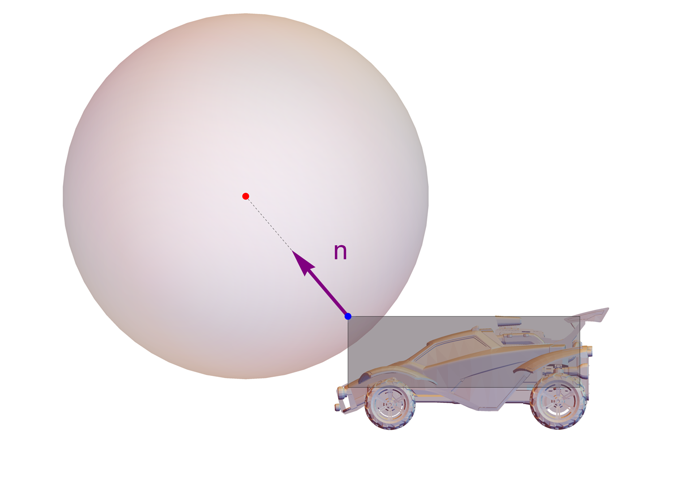

This constraint is enforced by taking the impulse that comes from the inelastic collision model above, and rescaling $$\boldsymbol{J}_\shortparallel$$ if it exceeds the maximum acceptable value: 

$$
\boldsymbol{J} \coloneqq \boldsymbol{J}_\perp + 
  \min(1, \mu \; \frac{\| \boldsymbol{J}_\perp \|}{\| \boldsymbol{J}_\shortparallel \|}) \; \boldsymbol{J}_\shortparallel
$$

I hope to release a complete reference implementation of this procedure in C++ soon.

## Psyonix Impulse

In order to tune the feel and control of the collisions in Rocket League, Psyonix applies 
an additional impulse to the center of ball (here $$\boldsymbol{p} \equiv \boldsymbol{x}_b$$) 
that is more predictable than the one directly from the physics engine.

This impulse is simple to describe, as it is given explicitly in terms of only the 
positions and velocities between the car and ball. Its value is given by:

$$
\boldsymbol{J} = m_b \; \| \Delta \boldsymbol{v} \| \; s(\| \Delta \boldsymbol{v} \|) \; \boldsymbol{n}
$$

where $$ \Delta \boldsymbol{v} \equiv \boldsymbol{v}_b - \boldsymbol{v}_c $$, and
the contact normal $$\boldsymbol{n}$$ can be computed by transforming the vector from the
car to the ball in the following way:

~~~cpp
vec3 f = car.forward();
vec3 n = ball.position - car.position;
n[2] *= 0.35f;
n = normalize(n - 0.35f * dot(n, f) * f);
~~~

and the scaling function $$s(\| \Delta \boldsymbol{v} \|)$$ is depicted below:

Oddly enough, this part of the collision violates Newton's 3rd Law of Motion, 
since Psyonix applies this impulse to the ball
without applying an equal and opposite impulse to the car. So, each time
you hit the ball in Rocket League, momentum is not conserved!

## Example Predictions and Observations

Consider the simple situation where a car approaches
the ball, jumps, and dodges forward to make contact (visualization
of actual game data, not a simulation):

<video autoplay loop muted>
<source type="video/webm" src="dodge_hit.webm">
Your browser does not support the video element.
</video>

This scenario was repeated several times by a bot, with
different initial separations between the car and ball.
It timed the dodges such that when the car contacts the ball, 
each run has identical velocity and angular velocity, 
but different orientation. The figures below are closeups
of the moment of contact for each run,
along with the exact velocity change of
the ball compared to the values predicted by the approach
described in this article.

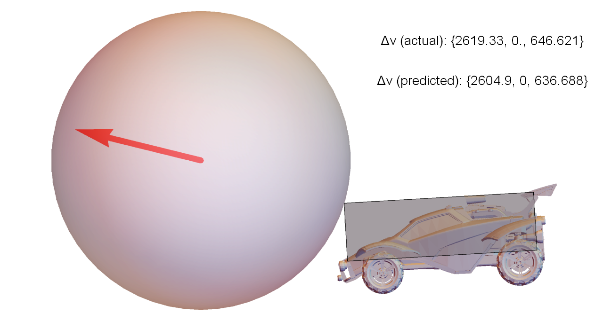
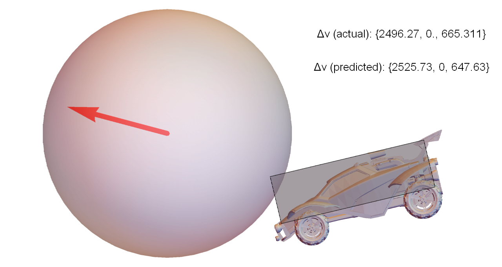
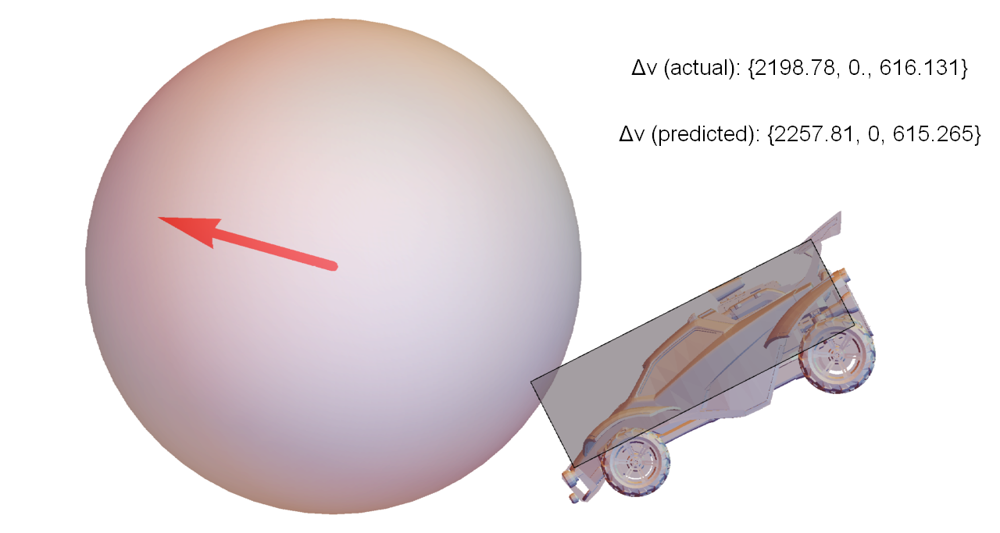
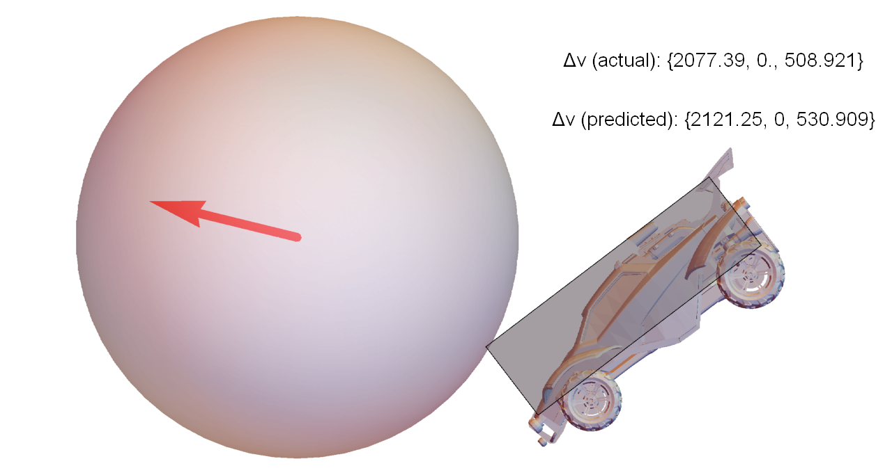
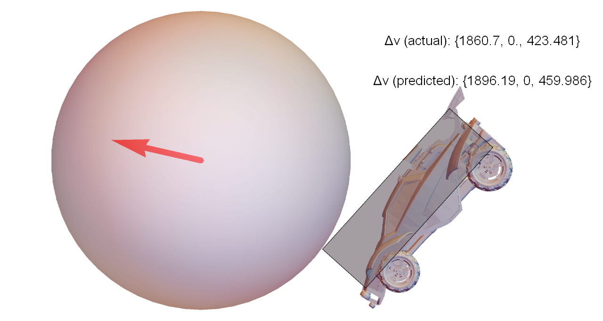
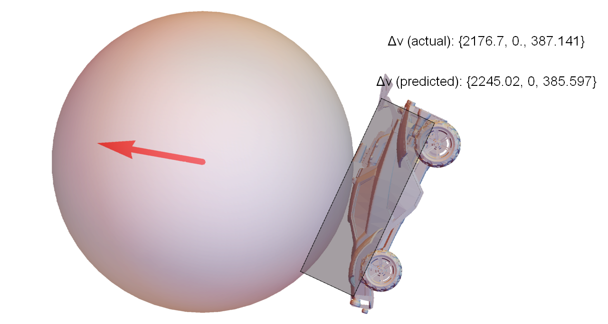
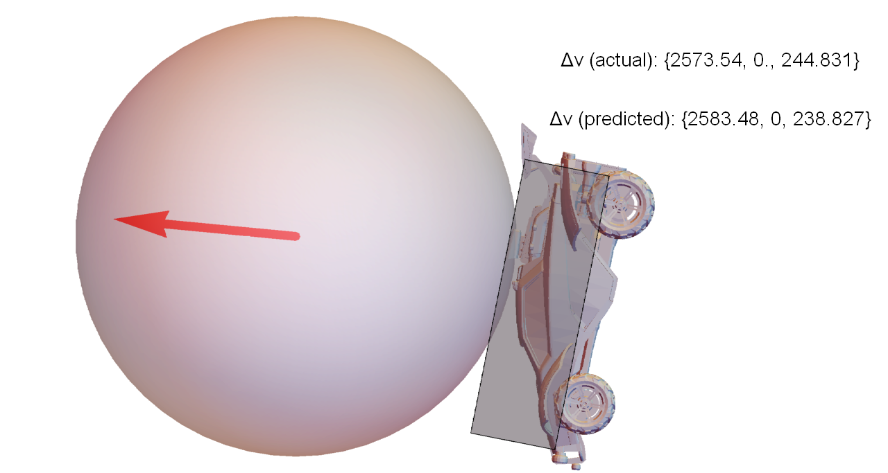
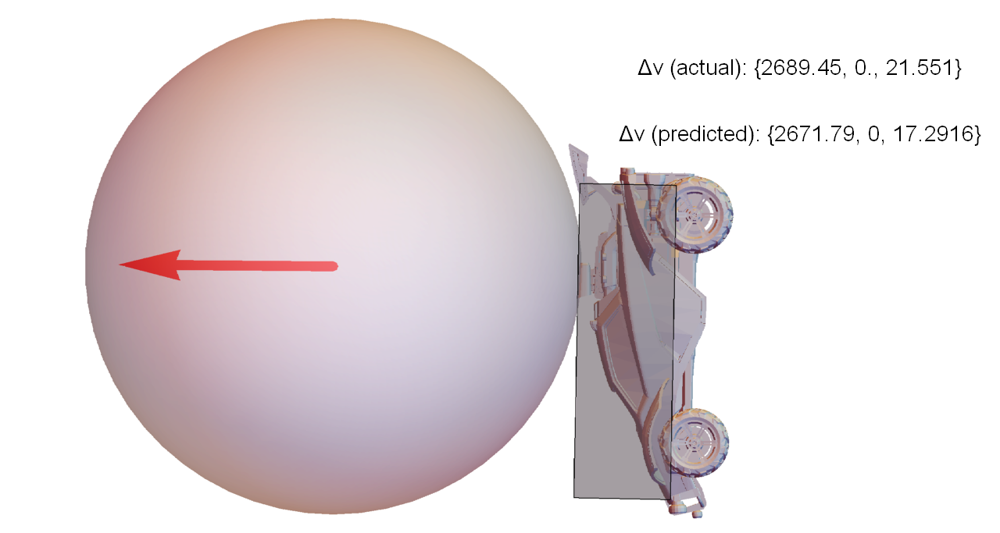
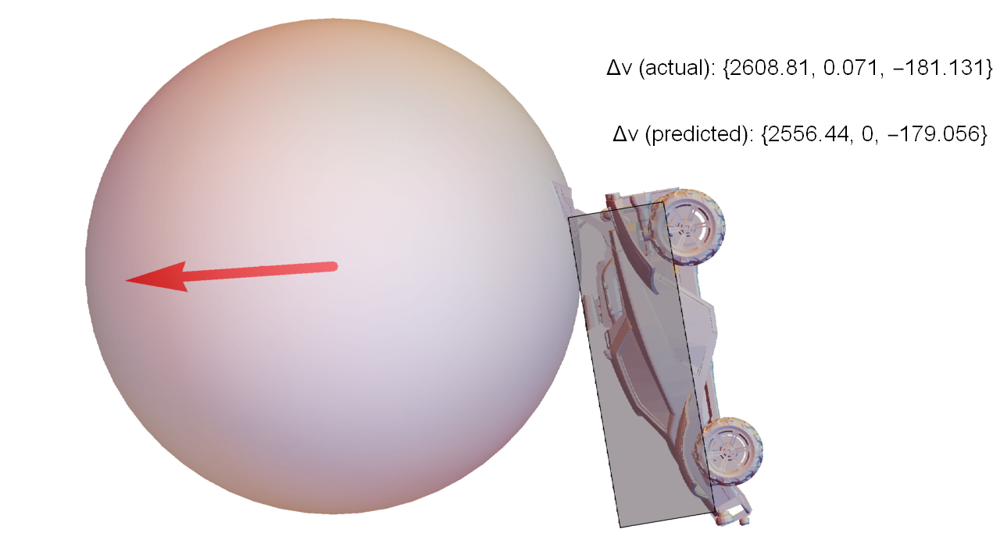
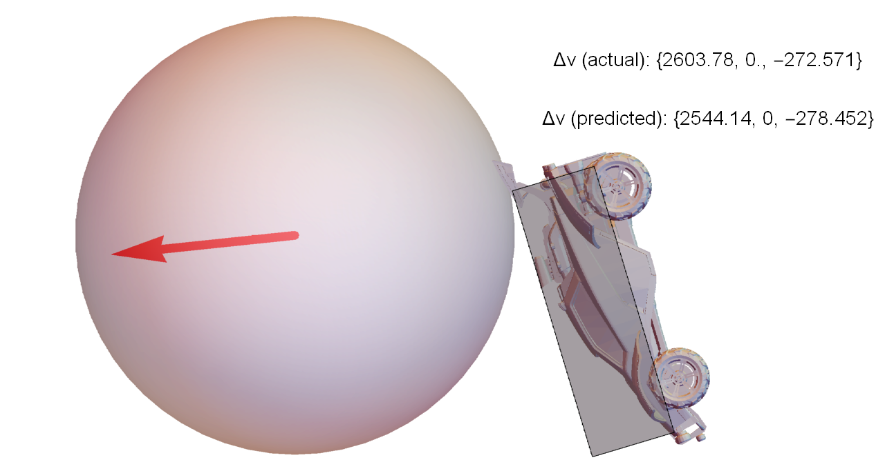
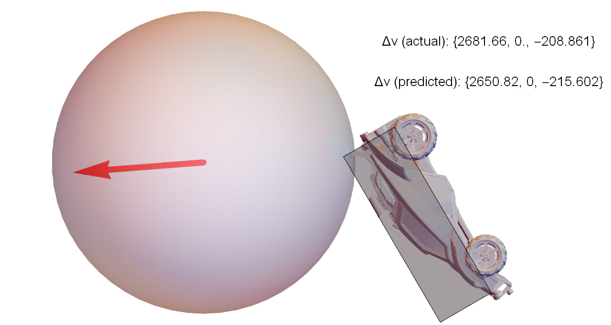
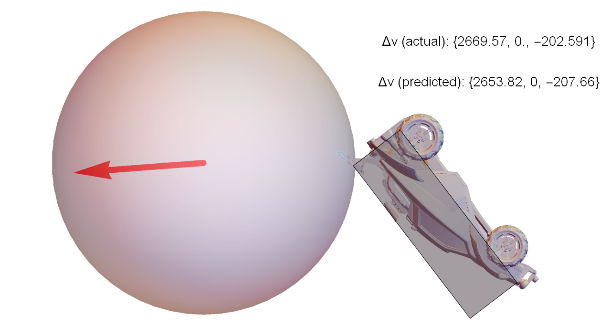

To put these values in perspective, the weakest hit in this set traveled for about 2500
units before hitting the ground again. The strongest hit was 40% faster, and
traveled 5200 units (over twice as far). 

So, even for a test where almost everything was constrained to be identical, varying
the orientation by a few degrees can make a huge difference in the outcome of the
collision.

## Final Thoughts

This model has been tested on a variety of different types of hits, including
dribbling, wall shots, aerial hits, and dodge shots. For these examples,
the error in the predictions is small enough to be negligible for practical
purposes (on the order of 0.1% to 3% error). 

This model is not suitable for wheel hits or pinches!
